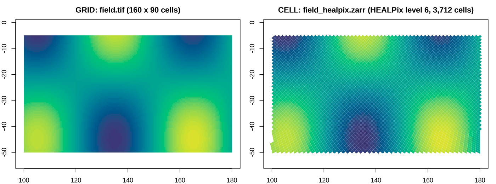

# meshcore (working name): first proof

One verb set for a raster (GRID) and a discrete global grid (CELL), with
arrays joined to either through a keyed dimension. Prototype R package.
Design notes, the mesh spec draft, the model zoo and the roadmap are in
[docs/](docs/README.md).

```r
remotes::install_github("hypertidy/meshcore")   # package name: meshcore
```

meshcore sits between [wkpool](https://github.com/hypertidy/wkpool)
(vertex pools and topology for any wk geometry; `as_wkpool()` hands one
over) and model packages that add their own models on the same verbs:
the `silicate2` branch of [silicate](https://github.com/hypertidy/silicate)
adds UGRID this way, and its methods make `edges()`, `face_edge()`,
`neighbours()` and the array join work on flexible meshes too.



## What it shows

```r
library(meshcore)
tif  <- system.file("extdata", "field.tif", package = "meshcore")
zarr <- system.file("extdata", "field_healpix.zarr", package = "meshcore")

for (x in list(GRID(tif), CELL(zarr))) {
  cells(x); boundaries(x); vertices(x); edges(x); face_edge(x)
  neighbours(x); neighbours(x, "vertex"); parent(x); children(x)
}
join_array(GRID(tif),  read_array(tif))            # key computed from x, y
join_array(CELL(zarr), read_array(zarr, "field"))  # key = cell_ids on "cells"
```

* `GRID("field.tif")` reads only the header; `CELL("field_healpix.zarr")`
  reads only the `cell_ids` array and its xdggs attributes (`grid_name`,
  `level`, `indexing_scheme`). Both through GDAL (classic and multidim
  APIs, via sf).
* Every table is computed from cell ids. Only `cells()` and `boundaries()`
  (and the hierarchy) are written per model; `vertices()`, `edges()`,
  `face_edge()` and `neighbours()` are one generic implementation on integer
  vertex keys. `edges()`, `face_edge()`, `as_wkpool()` and `n_cells()` are
  S3 generics, so a model with stored edges (UGRID) can return its own.
* `join_array()` is a join on cell id, no geometry. The GRID key is
  computed (`row * ncol + col`); the CELL key is the `cell_ids` coordinate
  variable. Both joins reproduce the generating field at cell centres
  (max error 5e-7 for Float32).

Run `Rscript inst/scripts/demo.R` for the printed walk-through and figure.

## The fast path: identity by construction

Every vertex has an integer lattice key computed from the cell id, so
shared corners are never found by comparing coordinates.

* **GRID**: key = `vrow * (ncol + 1) + vcol`.
* **HEALPix (nested)**: a corner on base face f at (cx, cy) has ring
  `i = jrll[f] * nside - cx - cy` and an exact integer longitude index (the
  polar-cap rings have `4i` corners). Key = `i * 8 * nside + q`. Corners
  shared across base faces and at the poles get one key with no merging.
* **hexlattice** (flat or pointy topped, the lattice
  `sf::st_make_grid(square = FALSE)` uses): corners are integer points of
  the honeycomb in half-radius units.

Proposal for the identity ladder: a new top rung, **lattice** (identity by
construction), above exact float. Models record `rung = "lattice"`.

## Checks

`tests/testthat`: 49 expectations, all passing.

* HEALPix full sphere, levels 0 to 5: V = 12 N^2 + 2, E = 24 N^2, F = 12 N^2
  exactly (Euler).
* HEALPix level 2 against healpy 1.20: centres and corners (N, W, S, E
  order) to 1e-12, and vertex neighbours identical to
  `healpy.get_all_neighbours` (including the 7-neighbour cells).
* Hexagons: counts identical to wkpool `merge_coincident()` on the same
  polygons, both orientations; all boundaries counter-clockwise.

Benchmark (`bench/hex-fastpath.R`, results in `bench/hex-fastpath.csv`),
on the benchmark's own `hex_grid(n)` inputs:

| input   | cells   | vertices | edges   | fast path (vertices + edges) | wkpool merge + edges |
|---------|---------|----------|---------|------------------------------|----------------------|
| hex_1e3 | 1,000   | 2,128    | 3,127   | 0.002 s                      | 0.02 s               |
| hex_1e4 | 10,000  | 20,404   | 30,403  | 0.016 s                      | 0.18 s               |
| hex_1e5 | 100,000 | 201,280  | 301,279 | 0.20 s                       | 2.3 s                |

Counts equal the silicate-vs-wkpool benchmark and wkpool on the same
polygons, and the vertex coordinates agree with wkpool's pool to 1e-9.
(wkpool timing includes `establish_topology()` from sf; wk 0.9.1 here.)

## Vocabulary crosswalk

| meshcore            | UGRID / uxarray / xugrid     | xdggs                      | OGC API DGGS           |
|---------------------|------------------------------|----------------------------|------------------------|
| `.cell`, `cells()`  | face, `n_face`, face_x/face_y | `cell_ids`, `cell_centers()` | zone, zone id        |
| `boundaries()`      | `face_node_connectivity`     | `cell_boundaries()`        | zone geometry          |
| `vertices()` (`.vx`)| node, `n_node`               |                            |                        |
| `edges()`           | `edge_node_connectivity`     |                            |                        |
| `face_edge()`       | `face_edge_connectivity`     |                            |                        |
| `neighbours()`      | `face_face_connectivity`     |                            | neighbouring zones     |
| `parent()`/`children()` |                          | `zoom_to(level)`           | parent zones, sub-zones |
| `level`             |                              | `level`                    | refinement level       |
| keyed dimension     | dimension `n_face`           | dimension `cells`          | zone data              |

`.vx`, `.vx0`, `.vx1` follow wkpool; `as_wkpool()` hands over an
already-merged pool (`.vx` 1..n, lattice key kept as `.key`).

## What the zoo still needs (found while building)

* **64-bit ids**: HEALPix ids are held in doubles, so level <= 24. Needs
  integer64 or a split (face, ipf) representation.
* **Ring indexing** for HEALPix (only nested now), and the ellipsoid
  (authalic latitude) for xdggs `ellipsoid` other than sphere.
* **Hexagon hierarchy**: the planar hexlattice has no parent/children. H3
  (aperture 7) and ISEA3H/ISEA4H need their own lattice keys, and their
  12 pentagons break the constant corners-per-cell assumption (the generic
  code already handles variable corner counts; the per-model key functions
  would not).
* **Antimeridian and poles**: vertex longitudes are canonical in
  (-180, 180]; geometry output (`as_wk()`) unwraps per cell around its
  centre. So `vertices()` of a regional grid that touches 180 can hold
  both 180 and -180: draw from `as_wk()`, not by joining `boundaries()`
  to `vertices()`. A real rule belongs in the spec.
* **GRID hierarchy** here is 2 x 2 blocks with the extent grown to whole
  blocks, which is not GDAL overview semantics (same extent, non-integer
  factor). Pick one.
* **Point to cell** (xdggs `sel_latlon`, GDAL pixel lookup) is the obvious
  next verb; it is what joins arrays on a different mesh to a model.
* **Reading**: uses `sf:::gdal_read_mdim` (internal) and `gdal_utils("mdiminfo")`.
  gdalraster's multidim support, if it has enough, would be the cleaner
  dependency. Zarr v2 in `inst/extdata` gives a hidden-files NOTE in
  `R CMD check`; v3 would not.

## Layout

```
R/model.R       GRID(), CELL(), print
R/healpix.R     nested ids, centres, corner lattice keys
R/lattice.R     GRID and hexlattice keys
R/verbs.R       the verb set; generic edges/neighbours from boundaries
R/array.R       keyed_array(), read_array(), join_array()
R/wk.R          as_wk(), as_wkpool()
inst/extdata    field.tif, field_healpix.zarr (made by inst/scripts/make-data.py)
inst/scripts    make-data.py (data + healpy reference), demo.R, demo.png
bench           hex-fastpath.R and results
```

Built and tested with R 4.3.3, sf 1.0-15 (GDAL 3.8.4), wk 0.9.1, wkpool
0.3.0.9006 (hypertidy/wkpool main after PR #5).
