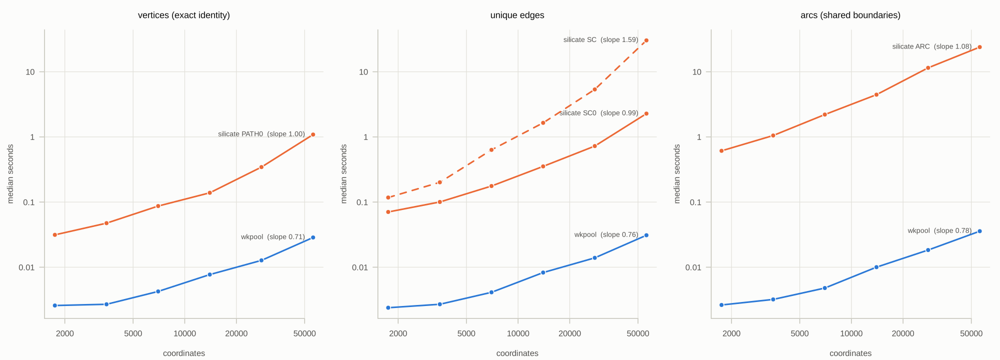
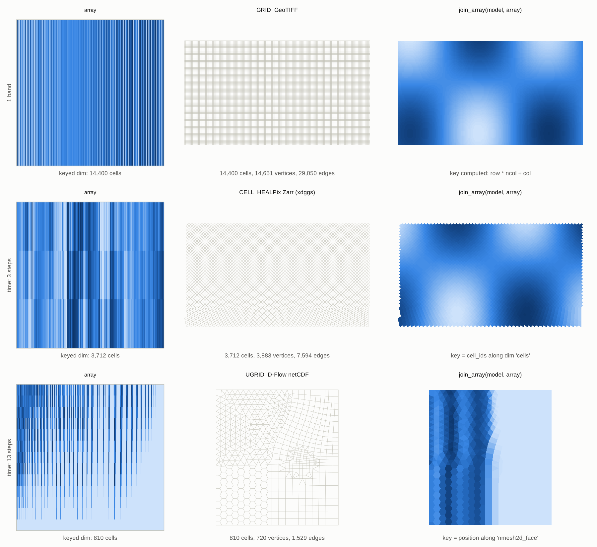
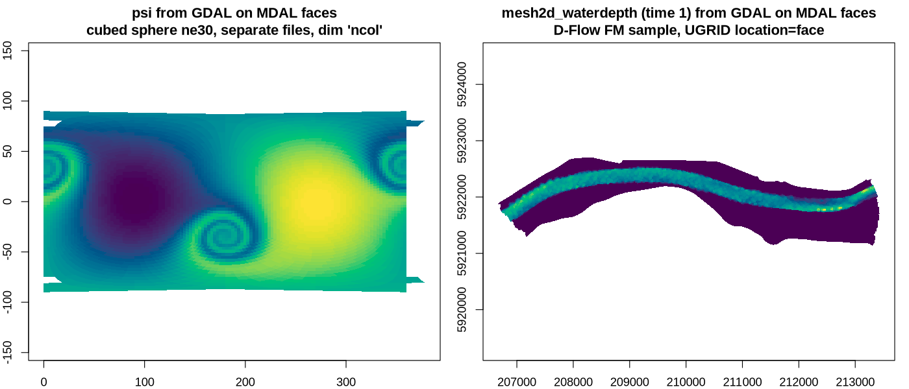

# Findings

What building things found, 7 and 8 October 2026. Each open question
below came out of building something, not from a list made in advance.

## The machinery is fast enough

silicate 0.7.1 (CRAN) against wkpool (main, after PRs #4, #5 and #6) on 9
inputs: nc, inlandwaters, hexagon coverages to 100k cells, densified
coverages, random-walk lines to 1M coordinates. Both agree exactly on
unique vertex and undirected edge counts for every input.

* Vertices: wkpool is 1.6x (1M coords of long lines) to 25x (100k
  hexagons) faster than `PATH0()`. Edges: 1.7x to 46x faster than `SC0()`.
  `SC()` and `ARC()` are 12x to 1300x slower than wkpool.
* wkpool scales linearly (log-log slope 0.71 to 0.78, linear plus fixed
  cost); `SC()` is superlinear (slope 1.59). 100k hexagons (700k coords):
  vertices 0.48 s, edges 0.52 s, arcs 0.67 s.
* wkpool #4 made `find_cycles`, `classify_cycles`, `hole_points` and
  `find_neighbours` linear (10k hexagons: `find_neighbours` 19 s and 13 GB
  down to 0.03 s). #5 made vertex lookup positional. #6 cut
  `cycles_to_wkb` from 5.7 s to 0.16 s.
* On lattices meshcore skips comparison entirely: 100,000 hexagons take
  0.20 s against wkpool's 2.3 s, with identical counts.

Script and results: `bench/` in hypertidy/wkpool (`scaling.csv`,
`timings.csv`, `counts.csv`).

Side finding: silicate's GitHub master (0.7.1.9001, after PR #144) is
broken: `.data$col` became string literals inside dplyr verbs in
`R/00_node.R`, `00_arc.R`, `00_edge.R`, `00_path.R`, so `SC(nc)` returns 1
edge instead of 1357. CRAN 0.7.1 is fine. Michael has fixes on another
system.

## Shared boundaries and holes

`inlandwaters` is the visual test: six features, 189 rings, 32 holes, and
borders that match vertex for vertex. After `merge_coincident()` the
quotient graph walks each shared border once: 201 arcs meeting at 13
nodes. Without `quotient = TRUE` every vertex on a shared border has
degree 4 and wkpool reports 2,619 nodes and 5,418 arcs. Use
`quotient = TRUE` for coverages.

## Arrays join by a keyed dimension

An array with a dimension keyed to a model's cells joins to that model by
id, with no geometry. The key can be computed (GeoTIFF `row * ncol + col`),
stored as a coordinate (xdggs `cell_ids` in Zarr) or implied by position
(UGRID `nmesh2d_face`). Both meshcore joins reproduce the generating field
at cell centres (max error 5e-7 for Float32).

## MDAL and GDAL multidim agree

MDAL reads mesh topology, GDAL's multidimensional API reads arrays, and
neither knows about the other. On the 5 meshes MDAL reads as UGRID (6
tried, uxarray and MDAL test data) they agree exactly on every node
coordinate and face corner, and 17 of MDAL's dataset groups are
bit-identical to the GDAL array bound to the same entity. Bindings in the
run: 1 declared, 50 ugrid, 12 name, 2 size.

Gaps the bridge found:

1. **MDAL loads no edges for 2D meshes**, so 17 edge arrays (fluxes,
   velocities) in the D-Flow files have nothing to attach to. Deriving
   edges from faces does not match the file's `edge_nodes` order, so the
   edge table has to come from the file's `edge_node_connectivity`. This
   argues for the UGRID model owning the entity tables, with MDAL as one
   reader among several.
2. **MDAL can silently return the wrong mesh.** `geoflow-small/grid.nc` is
   rejected by the Ugrid driver and falls back to the GDAL raster driver
   (15360 nodes and 11517 faces instead of 6000 and 3840). The
   key-agreement check catches it and is worth keeping as a validation.
3. **Data files often carry no mesh metadata** (`ncol` with no
   attributes), so only size or a declared key can bind them. Size is
   ambiguous when counts coincide; the binding reports its rung.
4. **MDAL datasets are same-file and renamed** (by `long_name`, u/v
   combined). GDAL multidim covers separate files, Zarr and HDF5.
5. rmdal build fixes went in as mdsumner/rmdal#1.

Prototype code is in the project files (`mdal-mdim/`), with a conda-forge
environment recipe (R 4.5, gdalraster 2.7, GDAL 3.13.3, MDAL 1.3.3).

## UGRID on meshcore's verbs

A UGRID model (silicate branch `silicate2`) runs on meshcore's verbs. It
reads all 9 real meshes tried from the uxarray and MDAL test suites
(quad-hexagon, cubed sphere ne30, RLL1deg, FESOM, D-Flow FM simplebox,
manzese 1D2D, ADCIRC, D-Flow3, a dflow1d network), joins face, node and
edge arrays through their keyed dimension, and round-trips D-Flow FM
through netCDF exactly. HEALPix level 2 as UGRID gives V - E + F = 194 -
384 + 192 = 2, a closed sphere.

## Open questions

| Question | Evidence | Candidate |
|---|---|---|
| Holes | UGRID faces are simple: inlandwaters loses 32 of 189 rings | A FACE model with rings, or a route through a triangulation engine |
| Orientation | FESOM stores 5,728 of 5,839 faces clockwise | An `orient()` verb in the shared set (planar `ugrid_orient()` exists) |
| The sphere and the antimeridian | 66 of 5,400 cubed-sphere, 538 of 64,800 RLL1deg and 15 of 192 HEALPix level 2 faces cross it; meshcore `vertices()` can hold both 180 and -180, `as_wk()` unwraps per cell | Spherical edges on wkpool's geodesic flag, or a cut rule in the spec |
| 64-bit ids | HEALPix ids held in doubles, so level 24 is the limit; UGRID int64 beyond 2^53 | integer64, or a split (face, ipf) form |
| HEALPix ring indexing, ellipsoid | Only nested now; xdggs `ellipsoid` other than sphere | Authalic latitude |
| Hexagon hierarchy | Planar hex lattice has no parent or children; H3 and ISEA have pentagons | Per-model lattice keys |
| GRID hierarchy | `parent()` uses 2 x 2 blocks with a grown extent, not GDAL overview semantics | Pick one |
| Point to cell | xdggs `sel_latlon`, GDAL pixel lookup | The next verb; it joins arrays on a different mesh |
| Dimension names | A cubed-sphere data file keys faces as `ncol` | Declared map, or by size, as xugrid and uxarray do |
| Edges from the file | MDAL loads none for 2D UGRID | UGRID owns entity tables (done: `edges()` is a generic) |
| Links between models | 1D2D files hold two meshes plus contacts | A link model between models |
| 1D network geometry | Deltares branch geometry lives in extra variables | Read it as PATH under the network's edges |
| Layers | FESOM and D-Flow3 have vertical levels | Arrays join with a layer column now; 3D cells wait for SIMPLEX |
| Reading | meshcore uses `sf:::gdal_read_mdim` (internal) | gdalraster multidim |
| Names and homes | meshcore, silicate2 and meshspec are working names | Open |
