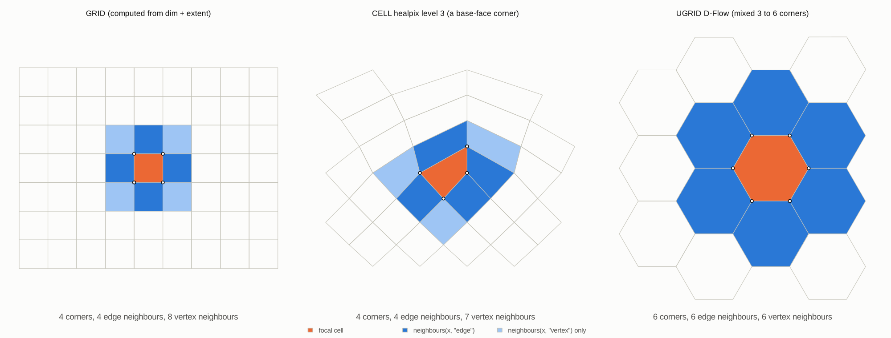

# Models, verbs and the zoo

Decided by Michael on 7 October 2026; updated 8 October 2026.

## Three layers

silicate's abstraction is kept and its machinery strengthened.

* **Models** say which entities exist and how they relate. A model is a
  set of keyed tables. The spec's forms are models written down: PSLG is
  roughly PATH plus SC, the triangle form is TRI, the drawable form is TRI0
  with positions.
* **Verbs** are small generics that return plain data frames. silicate's
  `sc_*` verbs keep their names; meshcore adds the cell verbs below. A
  default method sends anything wk can read through wkpool. Formats that
  already hold topology (TopoJSON, OSM, rgl mesh3d, UGRID, the laridae and
  trowel handles) implement the verbs directly.
* **Machinery** is wk, wkpool, the triangulation engines, GEOS, CGAL,
  GDAL and MDAL. Each model or package can choose its own.

## The verb set (meshcore)

| Verb | Kind | Returns |
|---|---|---|
| `cells()` | per model | One row per cell (`.cell`, centre) |
| `boundaries()` | per model | Cell corners in order (`.cell`, `.vx`) |
| `vertices()` | per model | One row per vertex (`.vx`, x, y) |
| `parent()`, `children()` | per model | Hierarchy, or a statement that there is none |
| `join_array()` | per model | An array joined to cells by keyed dimension |
| `edges()`, `face_edge()` | generic, derived | Undirected edges (`.vx0`, `.vx1`), cell-to-edge links; a model with stored edges returns its own |
| `as_wkpool()`, `n_cells()` | generic, derived | Hand-over to wkpool; counts |
| `neighbours(x, "edge" or "vertex")` | function | Cell adjacency by shared edge or vertex |
| `mesh_counts()`, `as_wk()` | function | V, E, F; geometry for drawing |

Ids are 0-based. `.vx`, `.vx0` and `.vx1` follow wkpool. See
[VERBS.md](../VERBS.md) and the vocabulary crosswalk (UGRID, uxarray,
xugrid, xdggs, OGC API DGGS) in the package README.

## Identity ladder

Vertex and edge identity is a level the model records, not a fact about
the data. The same input gives a different vertex and edge set at each
level. wkpool, not `unjoin()`, is the basis for the stored-vertex levels.

| Level | What counts as the same vertex | Machinery |
|---|---|---|
| 0. Lattice (proposed) | Same integer key computed from the cell id; nothing is compared | meshcore (GRID, HEALPix nested, hex lattice) |
| 1. Exact | Bitwise-equal coordinates | wkpool `merge_coincident(tolerance = 0)` |
| 2. Snapped | Equal after rounding, or within a tolerance | wkpool with a tolerance |
| 3. Noded | Equal after noding: crossings inserted, snap-rounded | GEOS or equivalent |
| 4. Exact predicates | Decided by robust geometric predicates | CGAL (laridae) |

The same idea applies on the key side, when an array dimension is bound to
a model's entities. The binding records its rung, strongest first:
**declared** (the caller says so), **ugrid** (`mesh` and `location`
attributes), **name** (dimension name equals a topology dimension),
**size** (dimension length equals exactly one entity count).

## The zoo

Models differ along four axes: primitive, stored or computed vertices,
structural or sequential ordering, and identity level. silicate's models
fill one corner (stored vertices, 1D and 2D primitives). The first new
models extend it to computed vertices.

| Model | Primitive | Vertices | Ordering | Status (8 Oct 2026) | Priority |
|---|---|---|---|---|---|
| GRID (regular; rectilinear and curvilinear later) | quad or cell | Computed from extent and dim | Structural | Built in meshcore | First |
| CELL (HEALPix, hex lattice; S2, H3 later) | cell id | Computed from the id | Structural | Built in meshcore (HEALPix nested, planar hex) | First |
| UGRID | node, edge, face (mixed) | Stored | Structural | Built on silicate branch `silicate2` | Next |
| SC, SC0 | segment | Stored | Structural | silicate | Port |
| PATH, PATH0 | path | Stored | Sequential | silicate | Port |
| ARC | arc | Stored | Sequential | silicate; wkpool arcs | Port |
| TRI, TRI0, DEL | triangle | Stored | Structural | silicate, anglr; the engines; UGRID to TRI route exists | Port |
| QUAD | quad | Stored (materialised GRID) | Structural | anglr | Port, via GRID |
| FACE (coverage) | polygon face with holes | Stored | Sequential cycles | wkpool cycles nearly give it | Later |
| HALFEDGE | half-edge | Stored | Structural | What the live handles are underneath | Later |
| SIMPLEX(k) | k-simplex | Stored | Structural | Generalises TRI to tetrahedra | Later |
| TRACK | path with time | Stored (xyt) | Sequential | The trip lineage | Later |
| GRAPH | directed, weighted edge | Stored | Structural | sfnetworks and dodgr territory | Later |

DUAL is a verb, not a model: Voronoi from TRI, an adjacency graph from FACE.

## The zookeeper

silicate2 (working name, branch `silicate2` on hypertidy/silicate) keeps
the zoo: a registry of models (`zoo_models()`), the conversion routes and
what each loses (`zoo_routes()`, `zoo_matrix()`), and validation
(`zoo_validate()`). Each empty cell in the matrix is a missing capability,
named.

Routes that exist now: UGRID to TRI (fan, face key kept), drawable, mesh3d,
wkpool, polygons, SC verbs and netCDF; into UGRID from netCDF, polygons and
lines (through wkpool), TRI, and any meshcore model (GRID, CELL).
Polygons lose their holes on the way into UGRID.

The branch is additive (new files, meshcore and wkpool in Suggests), so it
can merge into silicate later without breaking CRAN users. Consolidation
is an aspiration, not designed yet.

## Gaps in the machinery

| Gap | Needed by | Candidate | State |
|---|---|---|---|
| Grid index arithmetic | GRID | [vaster](https://github.com/hypertidy/vaster) | Exists; curvilinear needs 2D coordinate arrays |
| Cell id to geometry and neighbours | CELL | s2, an H3 binding, a HEALPix library | HEALPix nested done in meshcore; H3 and ring indexing thin |
| Mesh file I/O | UGRID | rmdal for topology; GDAL multidim for arrays | Bridge prototype works (see [findings.md](findings.md)) |
| Noding with provenance | FACE, level 3 | GEOS through geos or gdalraster | GEOS does not return which input made each output |
| Wire format for keyed tables | Every model | The mesh spec: Arrow plus key metadata | Drafted for three forms; GeoArrow has no indexed-topology type |
| Transforming a model | Every model | PROJ on vertex tables; densify for computed models | Needs a rule for when to materialise |

The gaps found by building GRID, CELL and UGRID are in
[findings.md](findings.md).
